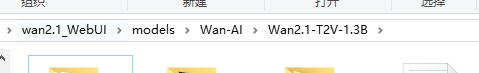
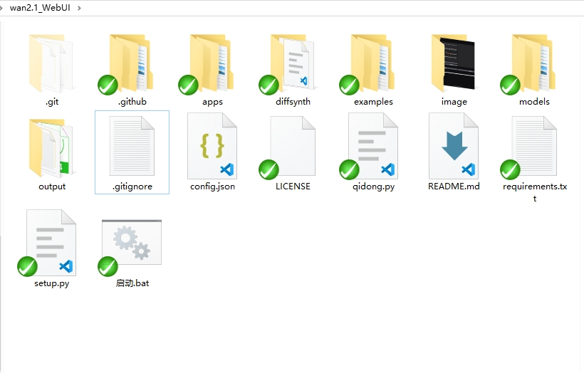
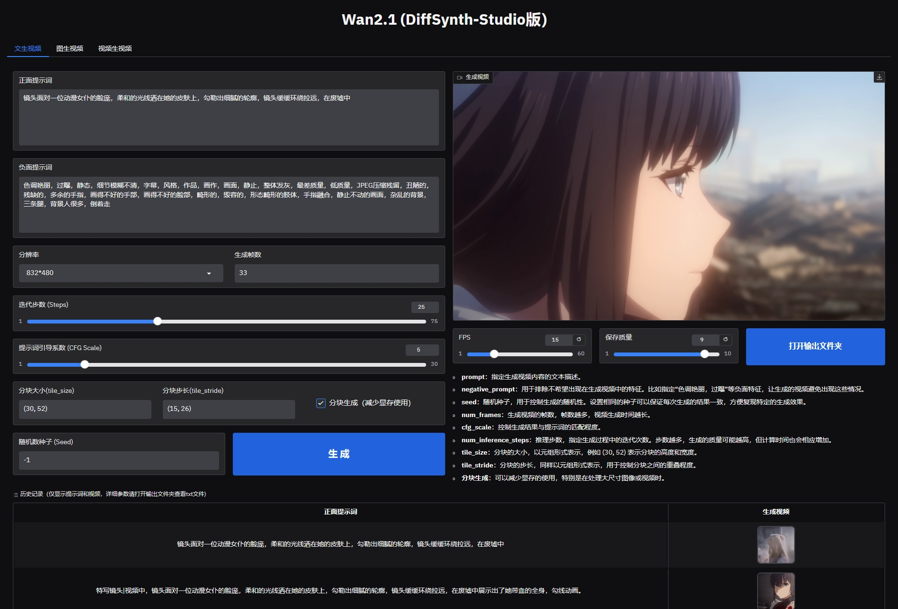

从DiffSynth Studio分支构建

## 安装

#### 使用整合包


或者


 __1，从源代码安装代码：__

``` sh
git clone https://github.com/qq1174565384/wan2.1_WebUI.git
```
<!--
```
cd wan2.1_WebUI
```
```
pip install -e .
```
-->

__2，下载1.3b模型__

在 __Wan2.1_WebUI__ 目录下


用 modelscope-cli下载模型命令:
``` sh
pip install modelscope
modelscope download Wan-AI/Wan2.1-T2V-1.3B --local_dir models/Wan-AI/Wan2.1-T2V-1.3B
```
确保 __Wan2.1-T2V-1.3B__ 文件夹在  wan2.1_WebUI\models\Wan-AI\  目录下

__3，安装环境__
在 __Wan2.1_WebUI__ 目录下
``` sh
pip install -e .
``` 


## 使用

双击
``` sh
启动.bat
``` 
打开浏览器进入
```
http://127.0.0.1:7860
```
剩下的就是让你的电脑尽情奔跑！




